# CineReviews

CineReviews is a reddit style web application aimed at users who like to read film reviews. On the backend of the website reviewers can create content using django admin page, they can create, read, update and delete their posts.

The users can login and create an account in order to upvote or downvote reviews.

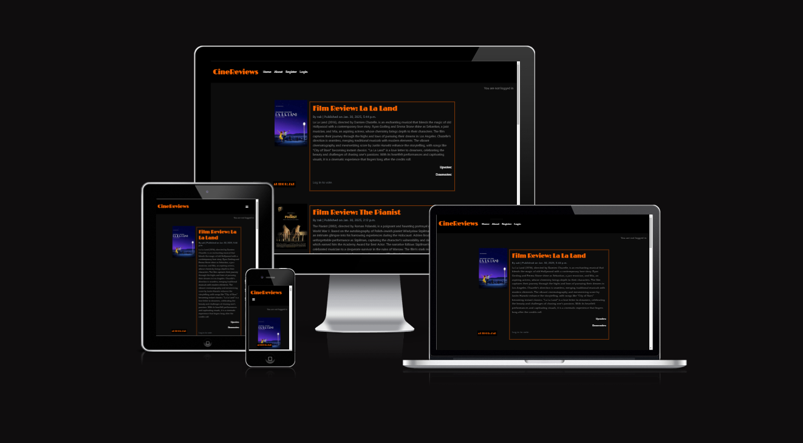
 
### Existing Features

- __Wireframe__

  - Wireframe I created before started the project so I had a starter template to work with.

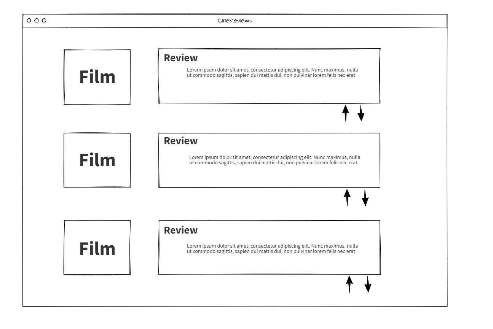

- __Navigation Bar__

  - Featured on every page, the full responsive navigation bar includes links to the Home page, About page and Login/Sign Up/Register, it is identical on each page to allow for easy navigation.
  - This section will allow the user to easily navigate from page to page across all devices without having to revert back to the previous page via the ‘back’ button.
  - The title CineReview is also a link back to the home page. 

- __Home Page (logged in)__

  - The home page features the review posts, they contain the review and an image of the film that is being reviewed.
  - When logged in the user can upvote or downvote the review.

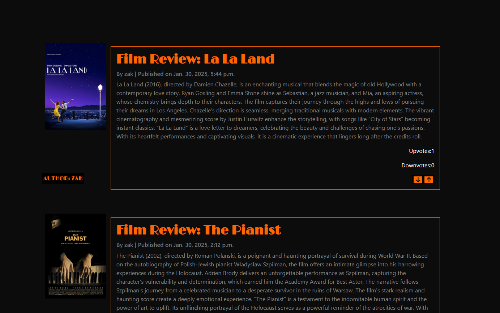

- __Home Page(logged out)__

  - The home page features the review posts, they contain the review and an image of the film that is being reviewed.
  - When logged out the user cannot upvote or downvote the review, there is text that displays to the user saying this.

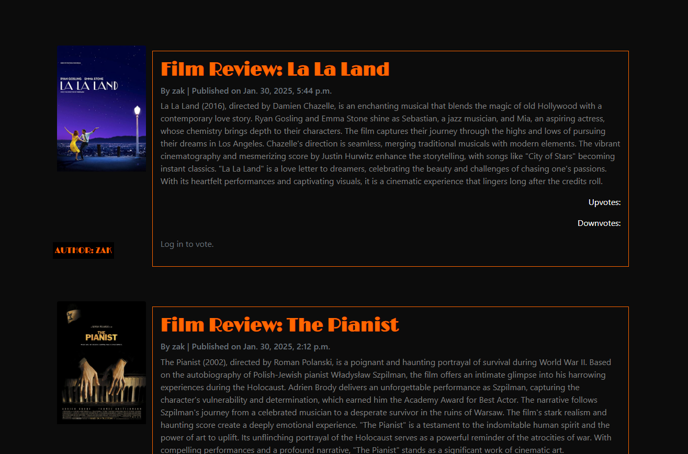

- __Footer__

  - The footer section includes links to the relevant social media sites for CineReviews. The links will open to a new tab to allow easy navigation for the user. 
  - The footer is valuable to the user as it encourages them to keep connected via social media.

- __About Page__ 

  -  The about page displays the content creators personal views on their favourite films and why they like films.
  -  The user can see what the page is about and adds context as to why the web page was created.

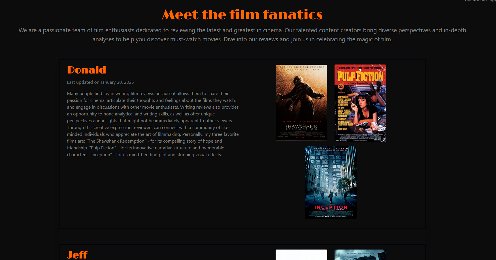

- __Sign In__

  - The sign in page allows the user to login and be able to use the restricted feature of upvotes and downvotes
  - There is an option for the user to check the remember me box for ease of the use the next time they use the website. 

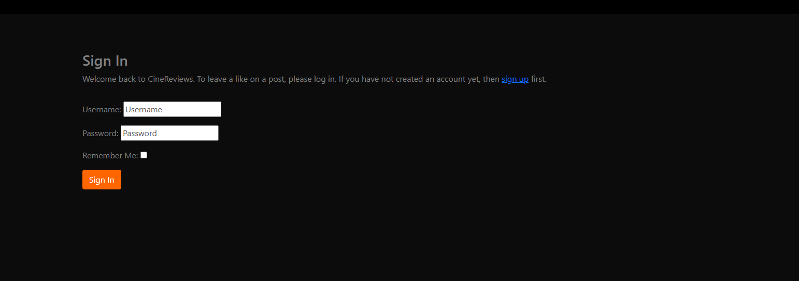

- __Sign Up__

  - This page allows the user to create an account so they can use the feature upvotes and downvotes on reviews.

- __Admin page__

  - This page allows creators to post reviews and use crud functionalities.

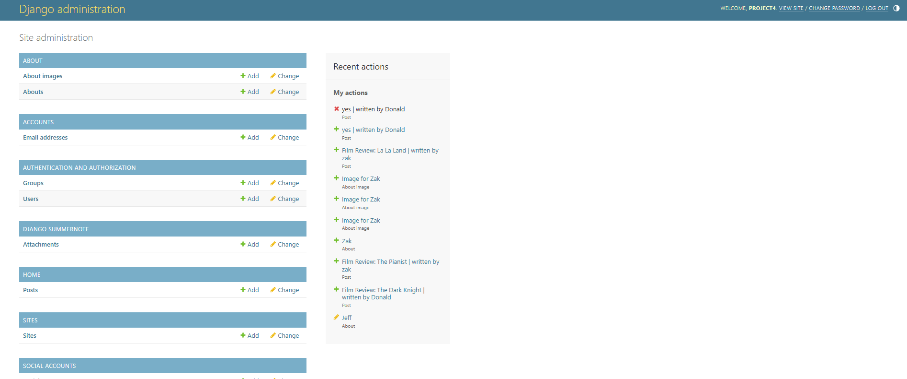

## User Stories

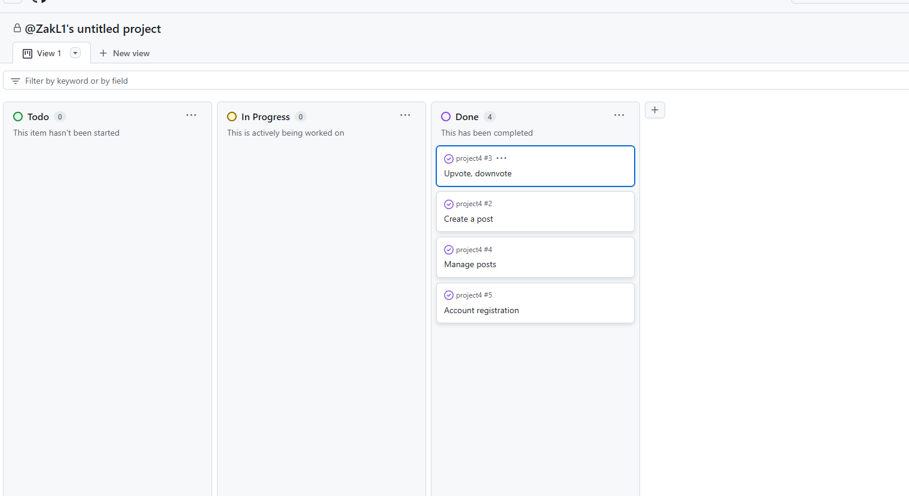

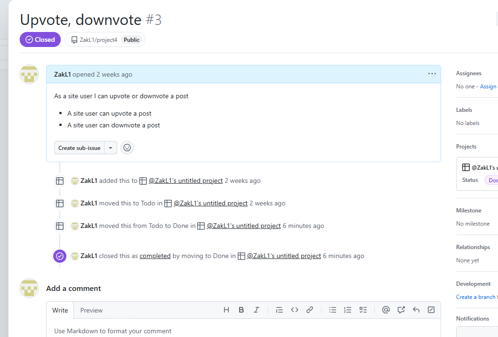

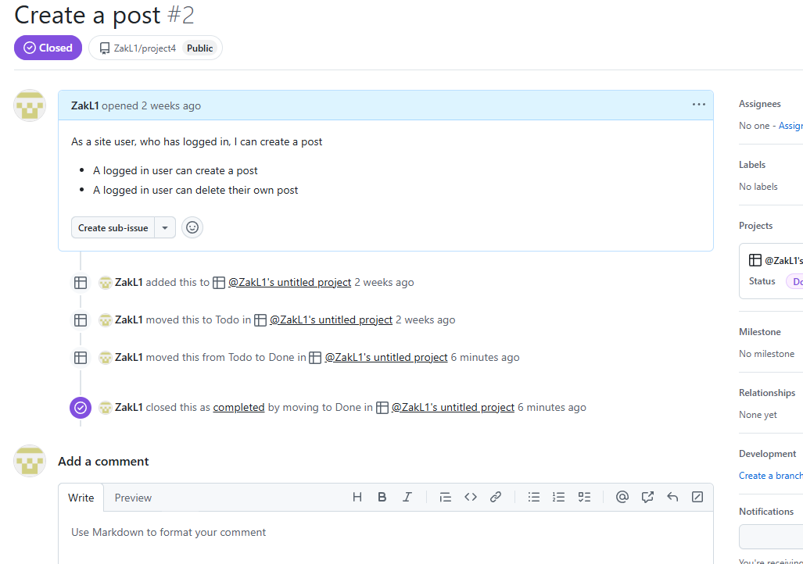

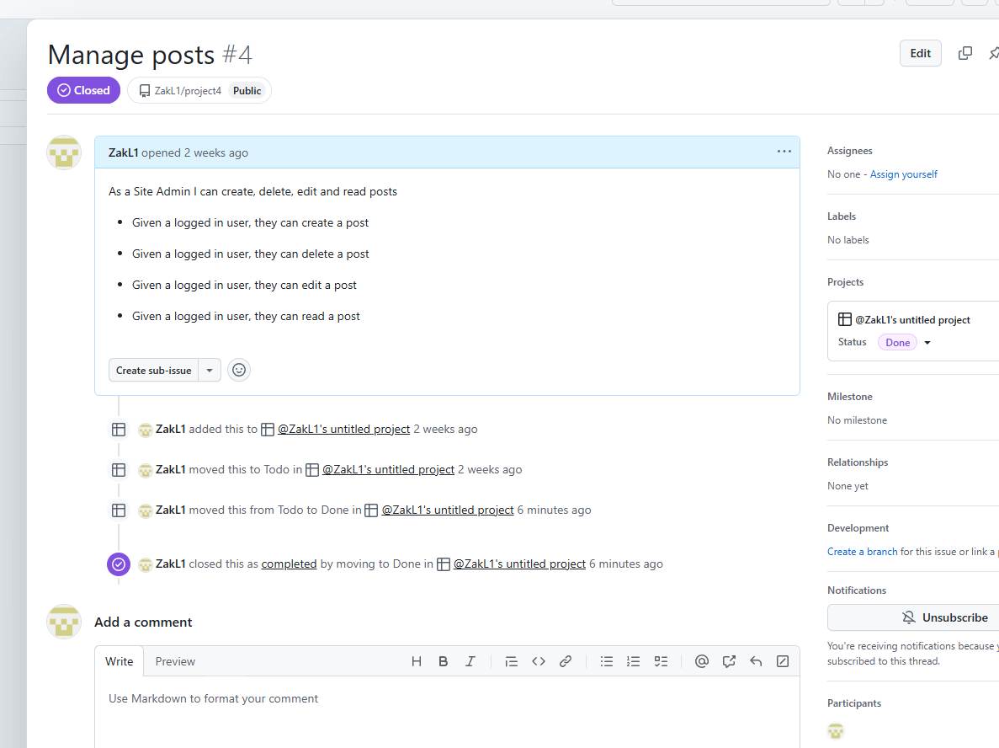

## Manual Testing 

- I tested the responsiveness by using devtools on google chrome, I tryed the page on all device sizes and made sure it readjusted each time.
- Fixed bug - borders weren't shrinkng to fit on tablets and smaller, so added bootsrap styles to html on main page (max-width: 100%) and (align-items: center)

- Second test
- I tested the functionailty of the nav bar, check that the links work by clicking them on each page and make sure button has hover affect for good user experience.
- No bugs found

- Third test
- I tested the functionality of the social media tags on the footer, making sure the user goes onto a new tab when clicked using (_targetblank)
- Fixed bug - buttons didn't have hover affect so added using css styles

- Fourth test
- I tested the sign in, register and sign out functionality, making sure no problems accur when re-entering data when logging in and out. Login data saved for users next time they want to log in.
- No bugs found

## Automatic testing

- Did not have time to implement this

### Validator Testing 

- HTML
  - No errors were returned when passing through the official [W3C validator](https://validator.w3.org/nu/?doc=https%3A%2F%2Fcode-institute-org.github.io%2Flove-running-2.0%2Findex.html)
- CSS
  - No errors were found when passing through the official [(Jigsaw) validator](https://jigsaw.w3.org/css-validator/validator?uri=https%3A%2F%2Fvalidator.w3.org%2Fnu%2F%3Fdoc%3Dhttps%253A%252F%252Fcode-institute-org.github.io%252Flove-running-2.0%252Findex.html&profile=css3svg&usermedium=all&warning=1&vextwarning=&lang=en#css)
- Javascript
  - No errors were found when passing through the official [Jshint validator](https://jshint.com/)
- Python
  - No errors were found when passing through the official [CI linter validator](https://pep8ci.herokuapp.com/)

### Unfixed Bugs

- When the logged in user clicks upvote or downvote it doesn't save when the website in refresh, I would need to implement a feature to save the upvotes/downvotes to the database
- Not a bug but heroku app name is different to project name.
- Bug in w3s html validator however django-allauth==0.57.2 has bug in the package itself, if I had more time I would install an older version but I jave run out of time.
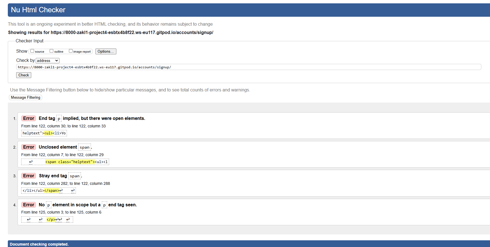

### Future features

- Make sure upvotes and downvotes save when the user closes the web app
- Add comments to reviews
- Reviews move up or down the page depending on how many upovotes/downvotes it has

## Deployment

- The site was deployed to GitHub pages. The steps to deploy are as follows: 
  - In the GitHub repository, navigate to the Settings tab 
  - From the source section drop-down menu, select the Master Branch
  - Once the master branch has been selected, the page will be automatically refreshed with a detailed ribbon display to indicate the successful deployment. 

- The site was deployed to Heroku. The steps to deploy are as follows: 
  - In Heroku create app and link with github 
  - Add procfile to your repository
  - Install gunicorn to your repository
  - In codestar settings add herokuapp to allowed hosts
  - When in heroku go to deploy branch and click deploy main

The live link can be found here - https://cine-votes-452f40e115f1.herokuapp.com/

## Credits 

### Content 

- ChatGPT was used for the content and debugging
- The icons in the footer were taken from [Font Awesome](https://fontawesome.com/)
- The fonts were taken from [Google fonts](https://fonts.google.com/)
- The CodeStar Blog project helped with some of the basic structure I used like the Nav bar and Footer
- A big thank you to the code intitute tutor team but especially Rebecca who helped with my final and most difficult problems on my project.

### Media

- All images are from google images
